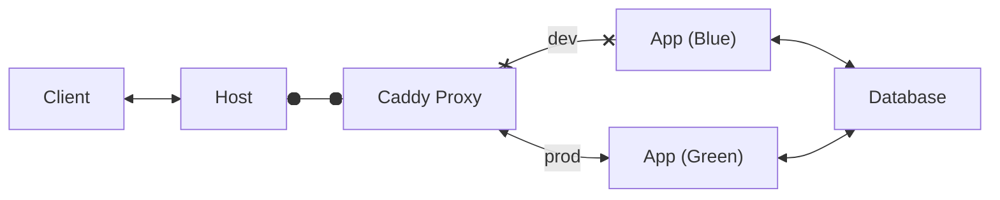

# Cyan

A web application pod following blue/green deployment principles utilizing caddy, nginx, and mysql.

```mermaid
graph LR;
    A[Client]<-->B[Host];
    B[Host]o--oC[Caddy Proxy];
    C x-- dev --xD["App (Blue)"];
    C<-- prod -->E["App (Green)"];
    D<-->Database;
    E<-->Database;
```

