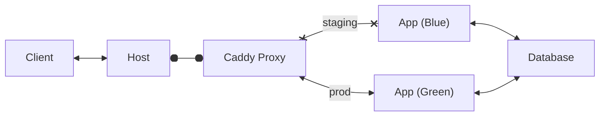

# Cyan
A web application pod proof of concept. Cyan illustrates a blue/green deployment schema 
using podman, quadlets, and caddy.



Inteded for educational purposes

## Installation
- Cyan uses rootless podman which can be installed via [Official Installation Instructions](https://podman.io/docs/installation)
    - This [Tutorial](https://github.com/containers/podman/blob/main/docs/tutorials/rootless_tutorial.md) includes additional instructions for rootless installs<br><br>

- Clone the cyan repo `git clone https://github.com/latelatelate/cyan.git`
    - Run `bin/init.sh` to move quadlet files into systemd folder and finish system configuration. 
        - Feel free to modify and move these manually<br><br>

- **Notes:**
    - Requires systemd for quadlet service management
    - Uses socket activation for the reverse proxy
    - Originally created on a debian host, so these instructions might need to be adapted for your specific environment

## Usage

Quadlets leverage systemd to manage containers and pods. Besides standard `podman` commands, we can also use:

```bash
systemctl --user status cyan-pod
systemctl --user start cyan-pod
systemctl --user stop cyan-pod
```

Individual services within pods can also be micromanaged:

```bash
systemctl --user reload cyan-proxy
```

### Zero Downtime Deployment

Swapping between app servers theoretically has zero downtime and is achieved by:
- Building a new app image
    - If necessary, updating the staging `.container` quadlet file with new `Image=build:tag`
        - Reload systemctl w/ changes `systemctl --user daemon-reload`
- Modifying the `cyan.internal.conf` file at `volumes/caddy-etc/conf.d/cyan.internal.conf`

Find the snippet in `cyan.internal.conf` containing:
```Caddy
# Main services on the custom network
https://cyan.internal {
    encode gzip zstd
	import green
	log
}
```

Specify with either `import blue` or `import green`

After modification, reload the proxy configuration:

```bash
systemctl --user reload cyan-proxy
```

Success! Traffic is routed through the new app container instead.