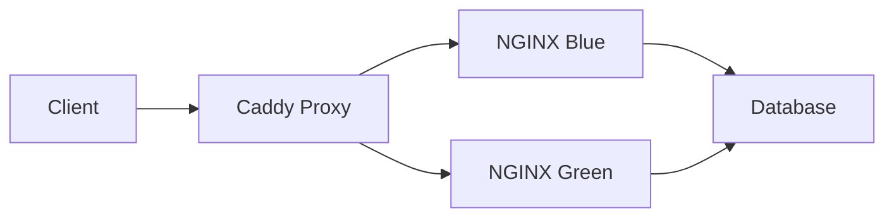

# README.md

Cyan is a containerized web application framework utilizing nginx, caddy, and mysql.



## TODO

- [ ] Host config automation via ansible?

```
- install packages
- configure sysctl
- configure firewall
- enable linger
- enable podman.socket
```

- [x] SSL Certificate Automation **(2/3)**
    - [x] How to handle distribution to pods + containers
    - [x] Self signed local dev?
    - [ ] LetsEncrypt for real certs?
        - How does swapping between live/dev work?

- [ ] Design Blue/Green Swap at proxy level
    - Current proxy workflow is prototyped for simplicity.
        - Just update `Caddyfile` with `blue` or `green` snippet and `systemctl --user reload cyan-proxy.service` 
    - Look into validation, health checks, and automation as you scale. Many production systems use this pattern: `git + reload + verification`.

- [ ] Determine best way to link repo files to dev server
    - Podman systemd configs
    - Storage volume data

## Design with abstraction layers in mind:
- Think in three layers:
    1️⃣ Platform layer (what you’re building now)
    ```
    Reverse proxy
    TLS termination
    Cert storage
    Reload semantics
    Networking model

    This layer must be project-agnostic.
    ```
    2️⃣ Environment layer (dev / staging / prod)
    ```
    Where certs come from
    How trust is established
    How domains resolve

    This is configuration, not code.
    ```
    3️⃣ Application layer (future projects)
    ```
    Virtual hosts
    Upstreams
    ```