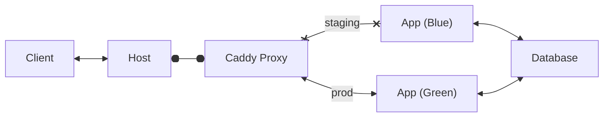

# Cyan

A web application pod following blue/green deployment principles utilizing podman and caddy.



## Usage

Quadlets utilize systemd to manage services. Besides standard `podman` commands, we can also use:

```bash
systemctl --user status cyan-pod
systemctl --user start cyan-pod
systemctl --user stop cyan-pod
```

Individual services within pods can also be micromanaged:

```bash
systemctl --user reload cyan-proxy
```

### Syncing quadlet files to systemd

Currently using rsync to update systemd quadlet files with repo changes. To sync:

```bash
rsync -avu --delete ${INSTALL_DIR}/quadlets/ ${QUADLET_DIR}
```